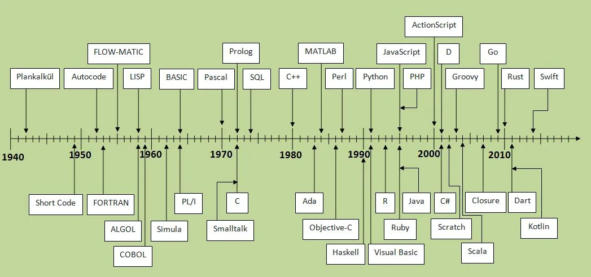

background-image: url(img/obi-wan.jpg)
background-size: contain

```{r setup, include=FALSE, echo=FALSE, fig.width=8, fig.height=8}
# paste this into the console before running `xaringan::inf_mr("twg_01.Rmd")`
# to make your entries faster (fraction of a second)
# options(servr.interval = 0.1)

fig_asp <- 0.618
fig_width <- 9
fig_out_width <- "6in"
fig_dpi <- 180
fig_align <- "center"
knitr::opts_chunk$set(
  collapse = TRUE,
  warning = FALSE,
  message = TRUE,
  comment = "#>",
  fig.asp = fig_asp,
  fig.width = fig_width,
  fig.path = "_bookdown_files/knitr-cache/",
  cache.path = "_bookdown_files/knitr-cache/",
  echo = FALSE,
  cache.comments = FALSE,
  dev = "png",
  dpi = fig_dpi,
  fig.align = fig_align
)

options(htmltools.dir.version = FALSE)
library(dplyr)
library(ggplot2)
library(gfplot)

ggplot2::theme_set(theme_pbs())
```

```{r xaringan-themer, include=FALSE, warning=FALSE}
library(xaringanthemer)
style_mono_accent(
  base_color = "#1c5253",# Matte green
  #base_color = "#cc6600ff", # Fall orange
  header_font_google = google_font("Josefin Sans"),
  text_font_google   = google_font("Montserrat", "300", "300i"),
  code_font_google   = google_font("Fira Mono")
)
```

---
class: left

### Outline

- My background
- Brief history of computation
- Compilation vs. Interpretation
- Indentation and syntax standards
- Documentation
- Directories and project control
- Speed and algorithms

---
class: left

### My background

<div class = "portrait"; style="float:right;position: relative; top: -80px;">
```{r chris-pic, eval = TRUE}

```
</div>

- Grew up in Nanaimo, B.C. and still there
- Started as a co-op student in 1999, and started full-time after finishing BSc.
- BSc. in Computer Science in 2000 UVIC
- MSc. in Earth & Ocean Science in 2006 (Ocean acoustics) UVIC
- Have been in the Groundfish section at the Pacific Biological Station ever since
- Started with database coding (Visual Basic for Applications & SQL)
- In 2003, started work with the Inshore Rockfish program and did submersible and ROV work,
  along with survey design and participation
- In 2007, was one of the maintainers and operators of the Phantom ROV we have at PBS
- In 2009, became program head of Pacific hake, took part in surveys and assessment processes
- In 2012, became one of the four assessment authors to do the annual assessment
- Began automating the document building process using the R package knitr and LaTeX
- In 2021/2022, implemented scripts and Docker containers to move the assessment code to cloud computing

---
class: center, middle, inverse

# Brief history of computation

---
class: left

### Computation was theorized completely before the hardware

- In 1936 Alan Turing derived a general example of the first CPU
- A theoretical machine that solves a particular problem on an infinite memory tape
  divided into cells with a head reader 
- Turing demonstrated that a Universal machine could exist that simulated a set of those machines
- This serial memory is in practice very limiting so we use Random Access Memory (RAM)

- A programming language is **Turing complete** if it is capable of simulating any Turing machine
- All current programming languages are Turing complete (if memory limitations are ignored)

---
class: left

### First functioning languages

- The first functioning languages were in the early 1950's
- FORTRAN is so low-level it is still used in super-computing for speed reasons. It is the oldest language still in use
- COBOL and BASIC were intended to be more programmer-friendly with English words as commands
- LISt Processing language (LISP) was specified in 1958 and is still in use. If you use Emacs, you're using a LISP dialect (ELisp)
- C was specified in 1972 
- C++ arrived in 1980, and is essentially C with object-oriented structures
- S Language for Statistical Computing was invented by Bell labs in 1976 and used FORTRAN
  subroutines
- R is an implementation of S and is written in C, Fortran, and R

```{r history-pic, echo = FALSE, eval = TRUE, out.height = 250}

```

---
class: center, middle, inverse

# Compilation vs. Interpretation

---
class: left

### Compilation

- Compilation is a process where the computer takes some code written in a language and generates machine
  code (a binary representation) in an executable file that can be run on a particular CPU

- Pre-compiled libraries are linked into the executable by the linker (eg. DLLs)
  
- Languages such as C, C++, Fortran, COBOL, and Rust are compiled Ahead-of-time (AOT compiler)

- Some languages (eg. Julia, Factor) are compiled at run time by a Just-in-time (JIT) compiler

<br />

<br />

```{r asseembler-pic, echo = FALSE, eval = TRUE, out.width = 800}

```
    
---
class: left

### Interpretation

 - Interpretation is when code is executed without being previously compiled. It is run *on-the-fly*
 - Examples of interpreted languages are Python, Javascript, Perl, Lisp, and R
 
 - For R, the interpreter does the following steps:
 
   - For each statement in your source code, for example:
   ```r
     x <- "Hello world"
   ```
   - Convert the statement into a functional form, evaluate and return an object:
   ```r
   `<-`(x, "Hello world")
   ```
   - Execute the function, which for complex or slow-running code may call a compiled function
     (compiled in C/C++)

---
class: left

### Pros of Compilation over Interpretation

- Execution time of interpreted code is a lot slower than for compiled code

- Compilation enforces strong typing which means you must define exactly what type a function's
  arguments must be and what type is returned **More on this later - R is weakly typed!**


### Pros of Interpretation over Compilation

- Interpreted code is usually platform-independent where compiled code needs to be compiled for a specific CPU

- Easier debugging: Direct source code debugging, can run source directly while paused in debug session


---
class: center, middle, inverse

# Paths and syntax standards

---
class: left

### Paths and filenames

- Your project/package should be completely system independent
- If you have something like this (absolute path) anywhere in your code it will instantly stop anyone else from being able to use it
   ```r
     dat_file <- "C:/Users/grandin/data_extraction/2021/q1/data_q1.csv"
   ```
- In this case, put the csv file and other files needed for the project into a directory easily referred to relatively from
  the project code directory, for example if you put *data_q1.csv* in a subdirectory called *data*:
   ```r
     dat_file <- "data/data_q1.csv"
   ```
- If using R, there's a package called **here** which detects the root directory for you, from
  which all relative paths will be based. The example above would be:
   ```r
     dat_file <- here("data/data_q1.csv")
   ```
- To guarantee where the root directory is for the *here* package, place an empty *.here* file where
  you want that to be. All paths will be relative to that location


---
class: left

### Paths and filenames (2)

```{r dir-structure-pic, echo = FALSE, eval = TRUE, out.width = 300}
knitr::include_graphics("img/directory-structure-showing-here.jpg")
```
- If you want to see what the root directory is and why it was chosen, run the `here::dr_here()` function:
```{r dr-here, echo = TRUE, eval = TRUE}
here::dr_here()
```

---
class: left

### Paths and filenames (3)

- In Windows, don't use double-backslashes for paths, this removes platform-independence and
  R has evolved way past needing this. For example, you *can* define a path like this for Windows:
```r
path <- "github\\main\\project"
```
but *don't*!
Always define it like this regardless of which OS you are on:
```r
path <- "github/main/project"
```

---
class: left

### Paths and filenames (4)

- Use `file.path()` to bind paths and filenames instead of pasting slashes in. It's too hard to keep track of
  whether or not slashes have been pasted in previously:
```{r file-path-pasting, echo = TRUE, eval = TRUE}
data_file <- file.path("github/main/project", "data_file.csv")
print(data_file)
```
- `here::here()` does this automatically, so just use that: 
```{r here-here-pasting, echo = TRUE, eval = TRUE}
data_file <- here::here("github/main/project", "data_file.csv")
print(data_file)
```
- If you want to be absolutely perfect you would do it this way:
```{r here-here-perfect-pasting, echo = TRUE, eval = TRUE}
data_file <- here::here("github", "main", "project", "data_file.csv")
print(data_file)
```

---
class: left

### Syntax standards

- This is covered very well in the [Advanced-R style guide](http://adv-r.had.co.nz/Style.html)

The main points are:
- Use all lowercase letters for variable names, with words being separated by underscores.
  Do not use capital letters
- Place spaces around all operators (**+**, **-**, **/** , *****, **=**, **,**, **%in%**).
  This includes array indexing, e.g `dat[1, , 2]`
- Opening brackets of all types should never go on their own lines
- Indent two spaces inside functions, if conditionals, and for loops
- Place a space before left parenthesis unless it is a function call
- use **<-** for assignment, not **=**

---
class: left

### File naming standards

- File names should end in .R
- File should be named with small letters only with words separated by dashes. eg.
  `utilities.R`, `plot-biomass.R`, `table-decisions.R`, `load-model-files.R`
- R source files should contain one function where possible and the filename
  should be the same as the function name except with dashes as separators
  instead of underscores.
  
  eg. file `plot-biomass.R` contains one function called `plot_biomass()`

- Exceptions to the one-file-rule are files like `utilities.R` which have small
  utility functions that each fit on one screen

```{r r-source-filenames-pic, echo = FALSE, eval = TRUE, out.width = 300}
knitr::include_graphics("img/r-source-filenames.jpg")
```
---
class: left

### Variable naming standards

- Standards apply to names for all functions, variables, and columns in data frames
- Use **snake case** in R
- Some different standards include:
  - flatcase - `spatialarea` (Java package names)
  - CapitalCamelCase - `SpatialArea` (C++ names, Java class names)
  - lowerCamelCase - `spatialArea` (Java variable names)
  - snake_case - `spatial_area` (Python variable names, R names)
  - UPPER_SNAKE_CASE - `SPATIAL_AREA` (Constants in many languages)
  - dotted.case - `spatial.area` (Some base R functions)
- The worst thing to do is some combination of styles eg. `spatial_AREA.newvar` 


---
class: left

### Base R has inconsistent naming

- Base R functions use different standards including dotted, snake case, camel case, upper camel case,
  and flat case. These are sometimes even mixed up in a single function.

- This is a major oversight and confusing for everyone

- The **data.frame()** function has arguments with two different types of naming syntax and a
  function call with a different syntax:
```{r data-frame-ex, echo=TRUE, size="tiny"}
data.frame
```


---
class: center

### Variable naming syntax

- Inconsistent function names:
  - `names()` vs `colnames()`
  - `row.names()` vs `rownames()`
  - `Sys.time()` vs `system.time()`
  


---
class: center

### Variable naming syntax (2)

.left[
Never use dotted variable naming syntax. Dotted syntax is reserved for custom class functions based on other generic functions.
]
.pull-left[.left[
```{r dotted-syntax, echo = TRUE, eval = FALSE}
j <- c(1:10)
par(mar = c(2, 2, 0, 0))
plot(j, type = "l", lwd = 3, col = "blue")
```
]]
.pull-right[
```{r plot-dotted-syntax, ref.label="dotted-syntax", echo = FALSE}
```
]
--
.pull-left[.left[
```{r dotted-syntax-2, echo = TRUE, eval = FALSE}
class(j) <- "reverse_series"
plot.reverse_series <- function(d, ...){
  plot.default(rev(d), ...)
}
par(mar = c(2, 2, 0, 0))
plot(j, type = "l", lwd = 3, col = "blue")
```
]]
.pull-right[
```{r plot-dotted-syntax-2, ref.label="dotted-syntax-2", echo = FALSE}
```
]

---
class: center, middle, inverse
# Standardizing your coding style

> "Good coding style is like using correct punctuation. You can manage without it, but it sure makes things easier to read."
> 
> `r tufte::quote_footer('- Hadley Wickham')`

---
class: center

### Style suggestions

.left[
We may have to live with the non-adherence of variable naming present in R's base code and that of some package developers, but we can and should follow best practices for variable naming syntax.

I follow *Hadley Wickam's Style Guide*:

**http://adv-r.had.co.nz/Style.html**

The main points are:
- Use all lowercase letters for variable names, with words being separated by underscores. Do not use capital letters
- Place spaces around all operators (**+**, **-**, **/** , *****, **=**, **,**, **%in%**). This includes array indexing, e.g `dat[1, , 2]`
- Opening curly brace should never go on its own line
- Indent two spaces inside functions, if conditionals, and for loops
- Place a space before left parenthesis unless it is a function call
- use **<-** for assignment, not **=**
]

---
class: center

### Style suggestions (2)

.left[
Example of good code style:
```{r good-code-style, echo = TRUE, eval = FALSE}
latex_mlc <- function(latex_vec,
                      make_bold = TRUE,
                      math_bold = FALSE){
  if(make_bold){
    if(math_bold){
      latex_vec <- purrr::map_chr(latex_vec, latex_math_bold)
    }else{
      latex_vec <- purrr::map_chr(latex_vec, latex_bold)
    }
  }
  latex_str <- paste(latex_vec, collapse = latex_nline)
  paste0("\\mlc{", latex_str, "}")
}
```
Note that
- **if()** and **for()** are functions so there should be no space before the left parenthesis
- the argument list has each argument on it's own line. This is easier to read and allows easy commenting-out of individual arguments
]

---
class: center

### Style suggestions (3)

.left[
Example of good code style using dplyr and pipes (`%>%`) mixed with ggplot and `+`:
]
.pull-left[.left[
```{r good-code-style-pipes, echo = TRUE, eval = FALSE}
library(dplyr)
library(ggplot2)
mtcars %>% 
  mutate(am = ifelse(am == 0,
                     "Automatic",
                     "Standard")) %>% 
  ggplot(aes(x = am, y = hp)) +
  geom_point() + 
  labs(y = "Gross horsepower",
       x = "Transmission")
```
]]
.pull-right[
```{r plot-good-code-style-pipes, ref.label = 'good-code-style-pipes', echo = FALSE}
```
]
.left[
Always place new items piped with `%>%` or added to ggplots with `+` on their own line:
  - Much easier to read
  - Allows them to be commented out easily
  - Less possibility of wrapping code past the end of the window frame

Other functions with multiple arguments should have their arguments on their own lines as well. See the `ifelse()` in the above example.
]

---
class: center, middle, inverse

# Variable Typing

---
class: center

### Variable typing

.left[
In most computer languages, variables are **strongly typed**. Here is an example in C++:

```{r example-string-typing, engine = 'Rcpp', echo = TRUE, eval = FALSE}
#include <iostream>
using namespace std;

double mult(double a, double b){
  double r;
  r = a * b;
  return r;
}

int main (){
  double z;
  z = mult(5, 3);
  cout << "The result is " << z;
}
```
In this code, *ALL* variables are given a datatype that they must adhere to, including the return value from the function.
This makes coding easier, because the compiler will tell you right away if you make a call to the function with an erroneous type.
]

---
class: center

### Variable typing (2)

.left[
In R, variables are **weakly typed**. In addition, R is **interpreted**, not **compiled** so you will not know there is a problem until your code runs to that point. This could take a long time, and then require fixing and re-running again to that point to ensure it is working.

```{r example-string-typing-r, echo = TRUE, eval = TRUE}
mult <- function(a, b){
  r <- a * b
  r
}
mult(5, 3)
```
In this code, variables are not typed and they could be anything. If we try to run the code with a different type than intended something possibly unexpected occurs:
```{r mult-data-frame, echo = TRUE, eval = TRUE}
d <- data.frame(j = c(1, 2, 3), k = c(4, 5, 6))
mult(5, d)
```
]

---
class: center

### Variable typing (3)

.left[
Well, maybe that wasn't so bad, but as the author of the function have you thought of what will happen with **every** data type and dimension of those data types? What about this:
```{r mult-mat, echo = TRUE, eval = TRUE, error=TRUE}
k <- data.frame(j = c(1, 2, 3), k = c(4, 5, 6), i = c(10, 11, 12))
mult(d, k)
```

This is obvious here, but when errors like this happen inside a function in someone else's package can be very frustrating. It can mean that you have to download the package source and debug the package.

These errors can be caught at the beginning of the function by checking all the variables for correct type and dimension. This is called **Argument verification**
]

---
class: center

### Argument verification

.left[
To emulate strongly typed languages, we can check all the arguments in a function. This involves comparing the class, length, and/or dimension of arguments with some known value. The following code will produce no errors.

```{r argument-checking, echo = TRUE, eval = TRUE}
library(checkargs)
test_func <- function(d = NULL, a = NULL, b = NULL){
  # Check that d is a data frame with 3 rows and two columns
  check_arg(d, chk_class = "data.frame", chk_dim = c(3, 2))

  # Check that a is a vector of numbers of length 10
  check_arg(a, chk_class = c("integer", "numeric"), chk_len = 10)

  # Check that b is a tibble with 3 rows and two columns
  check_arg(b, chk_class = "tbl_df", chk_dim = c(3, 2))
  
  # Actual function code would go here
  invisible()
}

test_func(d = data.frame(j = c(1, 2, 3), k = c( 4, 5, 6)),
          a = 1:10,
          b = tibble::tibble(j = c(1, 2, 3), k = c(4, 5, 6)))

```
]

---
class: center

### Argument verification (2)

.left[
Now, calling the function with the wrong length numerical vector we get an error explaining the issue:
```{r argument-checking-error1, echo = TRUE, eval = TRUE, error = TRUE}
test_func(d = data.frame(j = c(1, 2, 3), k = c(4, 5, 6)),
          a = 1:11,
          b = tibble::tibble(j = c(1, 2, 3), k = c(4, 5, 6)))
```
This time, the data frame is the wrong dimension:
```{r argument-checking-error2, echo = TRUE, eval = TRUE, error = TRUE}
test_func(d = data.frame(j = c(1, 2), k = c(4, 5)),
          a = 1:10,
          b = tibble::tibble(j = c(1, 2, 3), k = c(4, 5, 6)))
```
Now, send a variable valued `NULL`:
```{r argument-checking-error3, echo = TRUE, eval = TRUE, error = TRUE}
test_func(d = NULL,
          a = 1:10,
          b = tibble::tibble(j = c(1, 2, 3), k = c(4, 5, 6)))
```
]

---
class: center, middle, inverse

# Setting up your project

---
class: center

### Paths and portability

.left[
**Never** have lines like this in your project, it will break on any other machine and cause a high degree of frustration for those folks trying to use it.
```{r bad-path, echo = TRUE, eval = FALSE}
my_path <- "C:\\Users\\grandinc\\Data\\Projects\\2021"
```
One correct way to set up paths for your project is to use the `here` package. The `here::here()` function performs a search for the following to find the root directory of your project:

- contains a file .here
- contains a file matching [.]Rproj$ with contents matching ^Version: in the first line
- contains a file DESCRIPTION with contents matching ^Package:
- contains a directory .git

The function `here::dr_here()` tells you why your project root directory was chosen.
]

---
class: center

### Paths and portability (2)

.left[
Suppose you want to load a csv file from the **data** directory which is a subdirectory of the directory containing the **.here** file (i.e. the root directory):
```{r load-csv, echo = TRUE, eval = FALSE}
dat <- readr::read_csv(file = here::here("data", "datafile.csv"))
```

If you use `here::here()` everywhere in your project you can be assured it will run on everyone else's machine, regardless of which directory they place the project in.

You can also use `file.path()` with a pre-stored data directory variable:
```{r load-csv2, echo = TRUE, eval = FALSE}
data_dir <- here::here("data")
# Later on in the code ...
dat <- readr::read_csv(file = file.path(data_dir, "datafile.csv"))
```

These functions are portable across platforms, so that you don't have to paste together paths using the path separator like this:
```{r bad-path-method, echo = TRUE, eval = FALSE}
# BAD!
dat <- readr::read_csv(file = paste0(root_dir, "/data/datafile.csv"))
```
]

---
class: center, middle, inverse

# Promises and the ellipsis argument (...)


---
class: center

### Global variables are bad
.left[
  Global variables are not a good idea in any language 
  - Any function can read or write to them which means the global state of the program can change in many ways at any time
  - As the project complexity increases, keeping track of these changes becomes extremely
  - Eventually, debugging becomes impossible
]

---
class: center

### *Promise already under evaluation* error
.left[
Here is an example of some code which will cause a promise error
```{r promise-error, echo = TRUE, eval = TRUE, error = TRUE}
user_power <- function(val, pow){
  val ^ pow
}
power_list <- function(lst, ...){
  purrr::map_dbl(lst, function(list_item = .x, ...){
    user_power(list_item, ...)
  }, ...)
}
power_list(6:9, 3)
```
  
  This is caused by default arguments being set with the form `j = j` in the function declaration and can be easily fixed by changing the argument name like this
  ```{r fix-promise-error, echo = TRUE, eval = TRUE}
  j <- function(a, b, func){
    a + b
  }
  k <- function(my_j = j, a, b){
    my_j(a, b)
  }
  k(a = 3, b = 4)
  ```
  This can be very difficult to fix properly if you pass these variables through several functions, because you don't want to come up with a new name for the argument in each one. It can get really confusing really fast. The best way to solve this issue is to use the ellipsis argument
]

---
class: center

### Fix promise error with the ellipsis argument
.left[
```{r fix-promise-error-ellipsis, echo = TRUE, eval = TRUE}
j <- function(a, b){
  a + b
}
k <- function(j, ...){
  j(...)
}
k(j = j, a = 3, b = 4)
```

]

---
class: center, middle, inverse

# Avoid using `for()` loops

---
class: center

### `for()` loops should be avoided, use functional forms instead
.left[
Using `for()` loops come naturally to people familiar with procedural programming, and is more intuitive so newcomers to R tend to use them a lot.
```{r for-loop, echo = TRUE, eval = TRUE}
# Cube a vector of numbers
output <- NULL
for(x in 1:10){
  output[x] <- x ^ 3
}
print(output)
```
The same loop using base R's `lapply` method:
```{r sapply-loop, echo = TRUE, eval = TRUE}
unlist(lapply(1:10, function(x){x ^ 3}))
```
The same loop using the package `purrr::map_dbl()` method:
```{r map-loop, echo = TRUE, eval = TRUE}
purrr::map_dbl(1:10, ~{.x ^ 3})
```
The `purrr::map_dbl` method allows use of `~` as a shorthand form for `function(x)` and each list element is assigned to `.x` by `purrr`.
]


---
class: center

### Tibbles
.left[
**tibbles** are just **data.frames** with some special output properties so that viewing them in the console is much nicer. To convert a data frame to a tibble, use `tibble::as_tibble()`.

**tibbles** only show the first ten rows by default so the header doesn't run off the screen, and each column type is shown at the top. Seeing the column type is highly useful! Also, negative numbers are colored red (in RStudio).
```{r convert-to-tibble, echo = TRUE, eval = TRUE}
iris %>% as_tibble()
```
]

---
class: center

### Tibbles (2)
.left[
Making a tibble from scratch is the same as making a `data.frame`. This code makes a tibble of random letters and numbers and plots the distribution of random letters drawn using `ggplot`:
```{r make-tibble, echo = TRUE, eval = TRUE, out.height = 350}
num_rows <- 1000

# tibble::tibble(row = 1:num_rows,
#                number = sample(1:50, num_rows, replace = TRUE),
#                letter = letters[sample(1:26, num_rows, replace = TRUE)]) %>% 
#   mutate(number = as.character(number)) %>% 
#   tidyr::pivot_longer(cols = c("number", "letter"), names_to = "type", values_to = "value") %>% 
#   ggplot2::ggplot(aes(x = value, y = type)) +
#   ggplot2::geom_bar(fill = "#0000FF4D")
```
]

---
class: center

### Using `purrr::map2()`
.left[
One thing that come up quite often is that you have a list of data frames that need the list index number appended to the individual data frames.

One reason this happens is if you have N simulations and you want to append the simulation number to each data frame, and then merge those data frames into one large one so that the data are in the correct format for `ggplot` plots.
```{r fake-sim, echo = TRUE, eval = FALSE}
# Split the mtcars data frame by column `carb` into a list of data frames
lst <- mtcars %>% 
  tibble::as_tibble(rownames = "make") %>%
  dplyr::group_by(carb) %>%
  dplyr::group_split()

df <- purrr::map2(lst, seq_along(lst), ~{
  .x %>% dplyr::mutate(group_num = .y)
}) %>% 
  purrr::map_df(~{.x})

print(df, n = 100)
```
]

---
class: center

### Using `purrr::map2()`
.left[
```{r table-fake-sim, echo = FALSE, eval = TRUE, ref.label = "fake-sim"}
```
]

---
class: center

### Using `map()` with ellipsis passed to internal functions
.left[
This is a common thing you need to do if you're using the `map()` functions but strangely there are no examples that I could find online for this. Using this method you can pass N arguments into the function which is applied to each element of the list.

```{r map-ellipsis, echo = TRUE, eval = TRUE, error = TRUE}
ultimate_power <- function(val, pow){
  val ^ pow
}
power_list <- function(lst, ...){
  purrr::map_dbl(lst, function(list_item = .x, ...){
    ultimate_power(list_item, ...)
  }, ...)
}
power_list(6:9, 3)
```
]


---
class: center

### Power function is less efficient than multiplying
.left[
Squared operation
```{r power-function-optim, echo = FALSE, eval = TRUE}
loop_len <- 1000
sz <- 100000
a <- sample(1000, size = sz, replace = TRUE)
f <- function (n) for (i in 1:n) d <- a ^ 2
g <- function (n) for (i in 1:n) d <- a * a
system.time(f(loop_len))
system.time(g(loop_len))
```
Cubed operation
```{r power-function-optim-2, echo = FALSE, eval = TRUE}
a <- sample(1000, size = sz, replace = TRUE)
f <- function (n) for (i in 1:n) d <- a ^ 3
g <- function (n) for (i in 1:n) d <- a * a * a
h <- function (n) for (i in 1:n) d <- (a ^ 2) * a
system.time(f(loop_len))
system.time(g(loop_len))
system.time(h(loop_len))
```
Looking at the **user** time, the squared operation is faster than multiplying the number with itself. It is a special case of power which has been optimized in R. For higher degrees of power, it is much faster to use multiplication (7.8x faster) and the squared operation with multiplication (9.6x faster) rather than calculate using the power function (^) itself.
]


---
class: center

# Thank you!

Click the GitHub cat for the source code used to build these slides

<a href="https://github.com/cgrandin/good-code-practices" class="github-corner" aria-label="View source on Github"><svg width="80" height="80" viewBox="0 0 250 250" style="fill:#fff; color:#151513; position: absolute; top: 0; border: 0; right: 0;" aria-hidden="true"><path d="M0,0 L115,115 L130,115 L142,142 L250,250 L250,0 Z"></path><path d="M128.3,109.0 C113.8,99.7 119.0,89.6 119.0,89.6 C122.0,82.7 120.5,78.6 120.5,78.6 C119.2,72.0 123.4,76.3 123.4,76.3 C127.3,80.9 125.5,87.3 125.5,87.3 C122.9,97.6 130.6,101.9 134.4,103.2" fill="currentColor" style="transform-origin: 130px 106px;" class="octo-arm"></path><path d="M115.0,115.0 C114.9,115.1 118.7,116.5 119.8,115.4 L133.7,101.6 C136.9,99.2 139.9,98.4 142.2,98.6 C133.8,88.0 127.5,74.4 143.8,58.0 C148.5,53.4 154.0,51.2 159.7,51.0 C160.3,49.4 163.2,43.6 171.4,40.1 C171.4,40.1 176.1,42.5 178.8,56.2 C183.1,58.6 187.2,61.8 190.9,65.4 C194.5,69.0 197.7,73.2 200.1,77.6 C213.8,80.2 216.3,84.9 216.3,84.9 C212.7,93.1 206.9,96.0 205.4,96.6 C205.1,102.4 203.0,107.8 198.3,112.5 C181.9,128.9 168.3,122.5 157.7,114.1 C157.9,116.9 156.7,120.9 152.7,124.9 L141.0,136.5 C139.8,137.7 141.6,141.9 141.8,141.8 Z" fill="currentColor" class="octo-body"></path></svg></a><style>.github-corner:hover .octo-arm{animation:octocat-wave 560ms ease-in-out}@keyframes octocat-wave{0%,100%{transform:rotate(0)}20%,60%{transform:rotate(-25deg)}40%,80%{transform:rotate(10deg)}}@media (max-width:500px){.github-corner:hover .octo-arm{animation:none}.github-corner .octo-arm{animation:octocat-wave 560ms ease-in-out}}</style>
