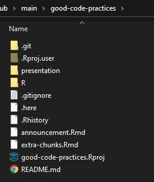
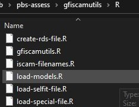

class: inverse

background-image: url(img/obi-wan.jpg)
background-size: contain

<style type="text/css">
code.r{ /* Code block */
  font-size: 10px;
} 
h3{
  margin-bottom: 0;
  padding: 0;
}
</style>

```{r setup, include=FALSE, echo=FALSE, fig.width=8, fig.height=8}
# paste this into the console before running `xaringan::inf_mr("twg_01.Rmd")`
# to make your entries faster (fraction of a second)
# options(servr.interval = 0.1)

fig_asp <- 0.618
fig_width <- 9
fig_out_width <- "6in"
fig_dpi <- 180
fig_align <- "center"
knitr::opts_chunk$set(
  collapse = TRUE,
  warning = FALSE,
  message = TRUE,
  comment = "#>",
  fig.asp = fig_asp,
  fig.width = fig_width,
  fig.path = "_bookdown_files/knitr-cache/",
  cache.path = "_bookdown_files/knitr-cache/",
  echo = FALSE,
  cache.comments = FALSE,
  dev = "png",
  dpi = fig_dpi,
  fig.align = fig_align)
  
options(htmltools.dir.version = FALSE)
library(dplyr)
library(ggplot2)
library(gfplot)

ggplot2::theme_set(theme_pbs())
```

```{r xaringan-themer, include = FALSE, warning = FALSE}
library(xaringanthemer)
style_mono_accent(
  #base_color = "#1c5253",# Matte green
  base_color = "#0B83B7", # Sky blue
  #base_color = "#cc6600ff", # Fall orange
  header_font_google = google_font("Josefin Sans"),
  text_font_google   = google_font("Montserrat", "300", "300i"),
  code_font_google   = google_font("Fira Mono")
)
```

```{r xaringan-animate-css, echo = FALSE}
xaringanExtra::use_animate_css()
```
```{r xaringan-logo, echo=FALSE}
#xaringanExtra::use_logo(image_url = here::here("presentation/img/rmarkdown.png"))
```
```{r xaringan-tile-view, echo = FALSE}
xaringanExtra::use_tile_view()
```

---
class: left

### Motivation

- Many of us are self-taught in computer coding

- Probably all have some bad habits which we could get away with in the past

- But now we share and collaborate on code a lot more (especially through
  GitHub)

  - bad habits can be annoying for collaborators

  - bad habits can be annoying for your future self

  - bad habits lead to wide eyes staring at space (E. Sheeran, respected programmer )
```{r ed, echo = FALSE, eval = TRUE, out.width = 100}

```

---
class: left

### Motivation

Things I figured out over the years

- help others and your future self: README files and documenting code

- setting up workflow (having organised folders)

- defining variables just once in code

- never use `T` and `F` for `TRUE` and `FALSE` -- took me a few hours of
    debugging once to learn this one

- it is often worth simplifying some code to make it more efficient (not that I
  always do)

- had previously thought you're fine to just use `=` instead of `<-`. Oops -- not any more
  (sorry!)

- working closely with Chris on Pacific Hake stock assessment has helped my
  coding habits, so thought it worth him sharing some best practices

- this is for TESA, and most stock assessment scientists are using R, so we'll
focus on R, but some tips are applicable for other languages

---
class: center, middle, inverse 

# Compilation vs. Interpretation

---
class: left

### Compilation vs Interpretation

#### Compilation

- A compiler takes some code written in a language and generates an executable file that can be run on a particular CPU

- Compilation enforces strong typing which means you must define exactly what type a function's arguments must be and what type is returned

- Examples of compiled languages are C++ and Fortran

#### Interpretation

- An interpreter "*compiles*" code line-by-line at run time

- Interpreted code is usually platform-independent / compiled code needs to be compiled for a specific CPU

- Examples of interpreted languages are Python, Perl, Lisp, and R

---
class: center, middle, inverse

# Paths and file organization

> "If the first line of your R script is"
>
> `setwd("C:\Users\me\path\only\I\have")`
>
> "I will come into your office and SET YOUR COMPUTER ON FIRE"
>
> "If the first line of your R script is"
>
> `rm(list = ls())`
>
> "I will come into your office and SET YOUR COMPUTER ON FIRE"
>
> `r tufte::quote_footer('- Jenny Bryan')`

---
class: left

### Directory structure - using `here::here()`

- To avoid this: `r emo::ji("fire")` `setwd("C:\Users\me\path\only\I\have")` `r emo::ji("fire")`

- Make everything in your project relative to a root project directory

- Use `here::here()`

- Example:
    - If you have data in file called `mydata.csv` somewhere on your computer, create a `data` directory as a subdirectory of your project directory and place `mydata.csv` in there

    - *Anywhere* in your project code, reference that `data` directory like this: `here::here("data")`

--

```{r, mydata, results = 'asis', echo = TRUE}
message(getwd())
data_fn <- here::here("data", "mydata.csv")
message(data_fn)
d <- read.csv(data_fn)
knitr::kable(d)
```

---
class: left

### Directory structure - how `here::here()` works

```{r dir-structure-pic, echo = FALSE, eval = TRUE, out.width = 300}

```
- If you want to see what the project's root directory is and why it was chosen, run the `here::dr_here()` function:
```{r dr-here, echo = TRUE}
here::dr_here()
```

---
class: left

### Changing directories in code

- Your code should *NEVER* contain the `setwd()` command. There's no need to change directories, ever.

```{r, never-setwd, echo = TRUE, error = TRUE}
message(getwd())
setwd("d:/github/main/good-code-practices/data")
d <- read.csv("mydata.csv")
message(getwd())
```

- It's a good bet that nobody else will be able to get the code to work.
  - the above code fails on Andy's computer with an error.

- It probably won't work on your next machine either.

- You have to manually navigate back to your project working directory if something breaks in your code `r emo::ji("facepunch")`.

- Instead do this:

```{r, never-setwd-instead, echo = TRUE, error = TRUE}
message(getwd())
d <- read.csv(here::here("data", "mydata.csv")) #<<
message(getwd())
```


---
class: left

### Creating paths to directories and files

- In Windows, don't use double-backslashes for paths, this removes platform-independence and
  R has evolved way past needing this. For example, you *can* define a path like this for Windows:
```r
path <- "github\\main\\project"
```

- Instead, define it with forward slashes regardless of which OS you are on:
```r
path <- "github/main/project"
```

- Or better yet, for complete platform-independence use `file.path()`:
```{r, file-path, echo = TRUE}
file.path("github", "main", "project")
```

- Notice that that command has the same syntax as `here::here()`:
```{r, here-here-similar-to-file-path, echo = TRUE}
here::here("github", "main", "project")
```

---
class: left

### File naming standards

- R code file names should end in .R

- File should be named with small letters only with words separated by dashes or underscores. eg.
  `utilities.R`, `plot-biomass.R`, `table-decisions.R`, `load-model-files.R`
- R source files should contain one function and the filename should be the same
  as the function name except with dashes as separators instead of underscores

  eg. file `plot-biomass.R` contains one function called `plot_biomass()`

- Exceptions to the one-file-rule are files like `utilities.R` which have small
  utility functions that each fit on one screen

.pull-left[
```{r r-source-filenames-pic, echo = FALSE, eval = TRUE, out.width = 300}

```
]
.pull-right[
```{r r-small-function-example, echo = TRUE, eval = FALSE}
vec2df <- function(vec, nms = NULL){
  if(!is.null(nms) && length(vec) != length(nms)){
    stop("The number of names supplied does not match the number ",
         "of elements in `vec`", call. = FALSE)
    names(df) <- nms
  }
  df <- vec |>
    enframe(name = NULL) |>
    t() |>
    as_tibble()

  if(!is.null(df)){
    names(df) <- nms
  }
  df
}
```
]

---
class: center, middle, inverse, bg_fir

# Variable naming and organization

> "There are only two hard things in Computer Science: cache invalidation and naming things."

-- Phil Karlton

> "There are only two hard things in Computer Science: cache invalidation, naming things, and off-by-one errors"

-- Unknown


---
class: left

### Variable naming standards

- Standards apply to names for all functions, variables, and columns in data frames

- Some different standards include:

  - flatcase - `spatialarea` (Java package names)

  - CapitalCamelCase - `SpatialArea` (C++ names, Java class names)

  - lowerCamelCase - `spatialArea` (Java variable names)

  - snake_case - `spatial_area` (Python variable names, R names)

  - UPPER_SNAKE_CASE - `SPATIAL_AREA` (Constants in many languages)

  - dotted.case - `spatial.area` (Some base R functions)

- The worst thing to do is some combination of styles eg. `spatial_AREA.newvar`

- Use **snake case** in R

```{r r-snake-case-example, echo = TRUE, eval = FALSE}
model_fn_lst <- list()
model_fn_lst$base_model <- here::here("models", "base-model", "base-model.rep")
model_fn_lst$sens_model_1 <- here::here("models", "sens-models", "sens-model-1.rep")
```

---
class: left

### Base R has inconsistent naming

- Base R functions use different standards including dotted, snake case, camel case, upper camel case,
  and flat case. These are sometimes even mixed up in a single function.

- This is a major oversight and confusing for everyone, but it is legacy and they can't change it now.

- One example is the `data.frame()` function which has arguments with two different types of naming syntax and
  some function calls inside with several different syntaxes - `anyDuplicated()` and `gettextf()`:
--
```{r data-frame-ex, echo = TRUE, size = "tiny"}
data.frame
```

---
class: left

### Don't use dotted names for variable names

- If you come from other languages, the dot typically means that what is to the left is a class and
  what is to the right is a method of that class (C++, Java) so this is very confusing for those people.
  eg. in C++: `string.size()`, in Java: `Socket.connect()`
- **Dotted syntax in R is meant to be used to signify the a method of a class.**  eg. `plot.default()`


--
.pull-left[.left[
```{r dotted-syntax, echo = TRUE, fig.show = "hide"}
a <- 1:10
par(mar = c(2, 2, 0, 0))
plot(a, type = "l", lwd = 3, col = "blue")
```
]]
.pull-right[.left[
```{r plot-dotted-syntax, ref.label="dotted-syntax", out.height = 150}
```
]]

```{r remove-a, echo = FALSE, eval = FALSE}
rm(a)
```
--
.pull-left[.left[
```{r dotted-syntax-2, echo = TRUE, fig.show = "hide"}
a <- 1:10

class(a) <- c(class(a), "revseries") #<<
plot.revseries <- function(d, ...){  #<<
  plot.default(rev(d), ...)          #<<
}                                    #<<

par(mar = c(2, 2, 0, 0))
plot(a, type = "l", lwd = 3, col = "blue")
```
]]
.pull-right[.left[
```{r plot-dotted-syntax-2, ref.label="dotted-syntax-2", out.height = 150}
```
]]
.pull-left[.left[
```{r class-check-series, echo = TRUE}
class(a)
```
]]

---
class: center, middle, inverse
# Standardizing your coding style

> "Good coding style is like using correct punctuation. You can manage without it, but it sure makes things easier to read."
>
> `r tufte::quote_footer('- Hadley Wickham')`

---
class: left

### Syntax style standards

We can and should follow best practices for variable naming syntax despite R base code having inconsistencies.

For R, this is covered very well in the [Advanced-R style guide](http://adv-r.had.co.nz/Style.html)
and the [Tidyverse style guide](https://style.tidyverse.org/).

The main points are:

- Use **snake_case** for naming

- Place spaces around all infix operators (**<-**, **+**, **-**, **/** , *****, **=**, **,**, **%in%**).
  This includes before indices in array indexing. Examples of this are:
  
  - `power_num <- function(a = 2, pow = 4)`
  - `y <- function(x, m, b){m * x + b}`
  - `dat[1, , 2]`
  - `arr_x[1, 1, ]`
  - `my_dataframe[, col_name_1]`

- Indent two spaces inside functions, if conditionals, and for loops

- use **<-** for assignment, not **=**

- Place a space before left parenthesis unless it is a function call.


---
class: left

### Syntax style standards - Poor vs properly formatted code
.pull-left[.left[
**Poorly formatted**
```{r batman-bad, echo = TRUE, eval = FALSE}
batman <- function(line_thick = 1){
  sc <- function(x) sqrt(1 - x ^ 2)
  el <- function(x) 3 * sc(abs(x) / 7)
  nl <- function(x) (-1) * el(x)
  sh <- function(x) 4.2 - 0.5 * abs(x) - 2.8 * sc(0.5 * abs(x) - 0.5)
  bf <- function(x) sc(abs(2 - abs(x)) - 1) - x ^ 2 / 11 + 0.5 * abs(x) - 3
  cr <- data.frame(x = c(0, 0.5, 0.8, 1), y = c(1.7, 1.7, 2.6, 0.9))
  cl <- data.frame(x = -cr$x, y = cr$y)
  plot_create<-function(fun, xmin, xmax){
    list(left_plot=stat_function(fun=fun,xlim=c(xmin,xmax),size=line_thick),right_plot =stat_function(fun = fun,xlim=c(-xmax,-xmin),size=line_thick))
}
  g<-ggplot(data.frame(x=c(-7,7),y=c(-3, 3)),aes(x, y))+theme_bw()+theme(panel.border = element_blank(),
    panel.grid.major = element_blank(), panel.grid.minor = element_blank(),
    axis.line = element_blank(), axis.text = element_blank(),axis.ticks = element_blank()) + labs(x = "", y = "")
  upper_wing_plot<- plot_create(fun = el, xmin = 3, xmax = 7)
  lower_wing_plot <-plot_create(fun = nl, xmin = 4, xmax = 7)
 g <- g +upper_wing_plot$left_plot+upper_wing_plot$right_plot+lower_wing_plot$left_plot +lower_wing_plot$right_plot
  sh_plot <- plot_create(fun = sh, xmin = 1, xmax = 3)
  g <- g +sh_plot$left_plot +
   sh_plot$right_plot
  bt_plot <- plot_create(fun = bf, xmin = 0, xmax = 4)
  g=g+bt_plot$left_plot+bt_plot$right_plot +geom_path(data = cr, na.rm = TRUE, size = line_thick)+geom_path(data = cl, na.rm =T,size =line_thick)
}
batman(5)
```
]]
.pull-right[.left[
**Properly formatted**
```{r batman-good, echo = TRUE, fig.show = "hide"}
batman <- function(line_thick = 1){
  sc <- function(x) sqrt(1 - x ^ 2)
  el <- function(x) 3 * sc(abs(x) / 7)
  nl <- function(x) (-1) * el(x)
  sh <- function(x) 4.2 - 0.5 * abs(x) - 2.8 * sc(0.5 * abs(x) - 0.5)
  bf <- function(x) sc(abs(2 - abs(x)) - 1) - x ^ 2 / 11 + 0.5 * abs(x) - 3
  cr <- data.frame(x = c(0, 0.5, 0.8, 1), y = c(1.7, 1.7, 2.6, 0.9))
  cl <- data.frame(x = -cr$x, y = cr$y)
  plot_create <- function(fun, xmin, xmax){
    list(left_plot = stat_function(fun = fun,
                                   xlim = c(xmin,xmax),
                                   size = line_thick),
         right_plot = stat_function(fun = fun,
                                    xlim = c(-xmax, -xmin),
                                    size = line_thick))
  }
  g <- ggplot(data.frame(x = c(-17, 17), y = c(-3, 3)), aes(x, y)) +
    theme_bw() +
    theme(panel.border = element_blank(),
          panel.grid.major = element_blank(),
          panel.grid.minor = element_blank(),
          axis.line = element_blank(),
          axis.text = element_blank(),
          axis.ticks = element_blank()) +
    labs(x = "", y = "")
  upper_wing_plot <- plot_create(fun = el, xmin = 3, xmax = 7)
  lower_wing_plot <- plot_create(fun = nl, xmin = 4, xmax = 7)
  g <- g +
    upper_wing_plot$left_plot +
    upper_wing_plot$right_plot +
    lower_wing_plot$left_plot +
    lower_wing_plot$right_plot
  sh_plot <- plot_create(fun = sh, xmin = 1, xmax = 3)
  g <- g +
    sh_plot$left_plot +
    sh_plot$right_plot
  bt_plot <- plot_create(fun = bf, xmin = 0, xmax = 4)
  g +
    bt_plot$left_plot +
    bt_plot$right_plot +
    geom_path(data = cr, na.rm = TRUE, size = line_thick) +
    geom_path(data = cl, na.rm = TRUE, size = line_thick)
}
batman(5)
```
]]

---
class: left

### Syntax style standards - Properly formatted code run
.pull-left[.left[
```{r batman, echo = TRUE, fig.show = "hide"}
batman <- function(line_thick = 1){
  sc <- function(x) sqrt(1 - x ^ 2)
  el <- function(x) 3 * sc(abs(x) / 7)
  nl <- function(x) (-1) * el(x)
  sh <- function(x) 4.2 - 0.5 * abs(x) - 2.8 * sc(0.5 * abs(x) - 0.5)
  bf <- function(x) sc(abs(2 - abs(x)) - 1) - x ^ 2 / 11 + 0.5 * abs(x) - 3
  cr <- data.frame(x = c(0, 0.5, 0.8, 1), y = c(1.7, 1.7, 2.6, 0.9))
  cl <- data.frame(x = -cr$x, y = cr$y)
  plot_create <- function(fun, xmin, xmax){
    list(left_plot = stat_function(fun = fun,
                                   xlim = c(xmin,xmax),
                                   size = line_thick),
         right_plot = stat_function(fun = fun,
                                    xlim = c(-xmax, -xmin),
                                    size = line_thick))
  }
  g <- ggplot(data.frame(x = c(-17, 17), y = c(-3, 3)), aes(x, y)) +
    theme_bw() +
    theme(panel.border = element_blank(),
          panel.grid.major = element_blank(),
          panel.grid.minor = element_blank(),
          axis.line = element_blank(),
          axis.text = element_blank(),
          axis.ticks = element_blank()) +
    labs(x = "", y = "")
  upper_wing_plot <- plot_create(fun = el, xmin = 3, xmax = 7)
  lower_wing_plot <- plot_create(fun = nl, xmin = 4, xmax = 7)
  g <- g +
    upper_wing_plot$left_plot +
    upper_wing_plot$right_plot +
    lower_wing_plot$left_plot +
    lower_wing_plot$right_plot
  sh_plot <- plot_create(fun = sh, xmin = 1, xmax = 3)
  g <- g +
    sh_plot$left_plot +
    sh_plot$right_plot
  bt_plot <- plot_create(fun = bf, xmin = 0, xmax = 4)
  g +
    bt_plot$left_plot +
    bt_plot$right_plot +
    geom_path(data = cr, na.rm = TRUE, size = line_thick) +
    geom_path(data = cl, na.rm = TRUE, size = line_thick)
}
batman(5)
```
]]
.pull-right[.left[
```{r plot-batman, ref.label="batman", out.height = 125}
```
[Original source code and explanation](https://charlotte-ngs.github.io/BatmanPlot/BatmanPlotPost.html)
]]

---
class: left

### Syntax style standards - dplyr, ggplot, and pipes

Example of good code style using dplyr, ggplot (`+`), and pipes (`%>%` or `|>`):
.pull-left[.left[
```{r good-code-style-pipes, echo = TRUE, eval = FALSE}
language <- read.csv(here::here("data", "prog-lang-data.csv")) |> 
  tibble::as_tibble() |> 
  dplyr::pull(2) |> 
  strsplit(";") |> 
  unlist() %>%
  gsub(".*Shell.*", "Shell", .)

tab <- table(language) |>
  tibble::as_tibble()

ggplot(tab,
       aes(x = language, y = n)) +
  geom_bar(stat = "identity",
           color = "black",
           fill = "blue",
           alpha = 0.2) +
  theme(axis.text.x = element_text(angle = 45,
                                   hjust = 0.55,
                                   vjust = 0.5)) +
  scale_y_continuous(labels = scales::comma) +
  coord_cartesian(ylim = c(0, 60000),
                  expand = FALSE) +
  xlab("Programming language") +
  ylab("Frequency")
```
]]

.pull-right[
```{r plot-good-code-style-pipes, ref.label = 'good-code-style-pipes', echo = FALSE}
```
]

Always place new items piped with `%>%` or `|>`, or geoms added to ggplots with `+` on their own line:
  - Much easier to read
  - Allows them to be commented out easily
  - Less possibility of wrapping code past the end of the window frame

Data source: [Kaggle](https://www.kaggle.com/datasets/deepakdhanoliya12/most-common-programming-languages-used-worldwide)

---
class: left

### Syntax style standards - Function arguments

- Example: `x` and `y` in this power function: `pow <- function(x, y){x ^ y}`

- Often they look like the [scan()](https://github.com/SurajGupta/r-source/blob/master/src/library/base/R/scan.R) function in base R.

.pull-left[.left[
**Hard to read**
```{r data-table-code-bad-arguments, echo = TRUE, eval = FALSE}
scan <- function (file = "", what = double(), nmax = -1L, n = -1L, sep = "", 
    quote = if (identical(sep, "\n")) "" else "'\"", dec = ".", 
    skip = 0L, nlines = 0L, na.strings = "NA", flush = FALSE, 
    fill = FALSE, strip.white = FALSE, quiet = FALSE, blank.lines.skip = TRUE, 
    multi.line = TRUE, comment.char = "", allowEscapes = FALSE, 
    fileEncoding = "", encoding = "unknown", text, skipNul = FALSE){
  # Function body code here
}
```
]]
.pull-right[.left[
**Easy to read**
```{r data-table-code-good-arguments, echo = TRUE, eval = FALSE}
scan <- function (file = "",
                  what = double(),
                  nmax = -1L,
                  n = -1L,
                  sep = "", 
                  quote = if (identical(sep, "\n")) "" else "'\"",
                  dec = ".", 
                  skip = 0L,
                  nlines = 0L,
                  na.strings = "NA",
                  flush = FALSE, 
                  fill = FALSE,
                  strip.white = FALSE,
                  quiet = FALSE,
                  blank.lines.skip = TRUE, 
                  multi.line = TRUE,
                  comment.char = "",
                  allowEscapes = FALSE, 
                  fileEncoding = "",
                  encoding = "unknown",
                  text,
                  skipNul = FALSE){
# Function body code here
}
```
]]

---
class: center, middle, inverse

# Variable Typing

---
class: left

### Variable typing - Strong typing

In most computer languages, variables are **strongly typed**. Here is an example in C++.

- In this code, **all** variables are given a datatype that they must adhere to, including the return value from the function.

- This produces fewer runtime bugs, because the compiler will tell you right away if you make a call to the function with the wrong type.

.pull-left[.left[
```{r example-string-typing, engine = "Rcpp", echo = TRUE, eval = TRUE}
#include <Rcpp.h>
using namespace Rcpp;

// [[Rcpp::export]]
int fibonacci(int x) {

  bool base_num = x == 0 || x == 1;

  if(base_num)
    return(x);

  return(fibonacci(x - 1)) + fibonacci(x - 2);
}
```

```{r fib, echo = TRUE, eval = TRUE}
fibonacci(12)
```
]]

---
class: left

### Variable typing - Weak typing

In R, variables are **weakly typed**. In addition, R is **interpreted**, not **compiled** so you will not know there is a problem until your code runs to that point

.pull-left[.left[
**Working code**
```{r example-string-typing-r, echo = TRUE, eval = TRUE}
#' Multiply two numbers
mult <- function(a, b){
  r <- a * b
  r
}

mult(5, 3)
```
]]

.pull-right[.left[
**Error - wrong type in call**
```{r mult-data-frame-with-chars, echo = TRUE, eval = TRUE, error = TRUE}
d1 <- data.frame(j = c(1, 2, 3), k = c(4, 5, "a"))

mult(5, d1)
```
]]

- Weak typing leads to runtime errors. The only way in R to make sure the correct types are being passed as function arguments is to do **Argument verification**

- **Argument verification** is essentially checking the types and dimensions of arguments at the beginning of a function.


---
class: left

### Argument validation
- For strongly typed languages, this is done by the compiler automatically and does not add overhead to the runtime performance.
- For weakly typed languages, any code added in the function to check types is executed at runtime and will make your code slow.
- There is a tradeoff here, fast code with no argument validation or slow code with complete validation.

.pull-left[.left[
```{r arg-validation, echo = TRUE, eval = FALSE, fig.show = "hide"}
get_model_info <- function(model_match, case_sens = TRUE){
  
  if(!"character" %in% class(model_match)){
    stop("`model_match` does not have class character", call. = FALSE)
  }
  if(length(model_match) > 1){
    stop("length of `model_match` must be 1, you passed a length ",
         length(model_match), " vector", call. = FALSE)
  }
  if(!"logical" %in% class(case_sens)){
    stop("`case_sens` does not have class logical", call. = FALSE)
  }
  if(length(case_sens) > 1){
    stop("length of `case_sens` must be 1, you passed a length ",
         length(case_sens), " vector", call. = FALSE)
  }
  orig_car_dat <- mtcars |> as_tibble(rownames = "model")
  car_dat <- orig_car_dat
  if(!case_sens){
    model_match <- tolower(model_match)
    car_dat$model <- tolower(car_dat$model)
  }
  grp <- grep(model_match, car_dat$model)
  if(!length(grp)){
    stop("`model_match` does not match any model names in the ",
         "table", call. = FALSE)
  }
  orig_car_dat |> select(mpg, cyl, disp, hp, am, gear) |> slice(grp)
}

get_model_info(2)
get_model_info(c("mazda", "toyota"))
get_model_info("datsun", 1)
get_model_info("mazda", case_sens = FALSE)
```
]]
.pull-right[.left[
```{r arg-validation-show, ref.label = "arg-validation", error = TRUE}
```
]]

---
class: center

---
class: center, middle, inverse

# Promises and the ellipsis argument (...)

---
class: left

### Global variables are bad

- Global variables are not a good idea in any language
  - Any function can read or write to them which means the global state of the
    program can change in many ways at any time
  - As the project complexity increases, keeping track of these changes becomes
    extremely difficult and frustrating
  - Eventually, debugging becomes impossible

- Pass all variables as arguments to functions instead
  - This can be tedious if you are passing variables through multiple functions
    in a chain fashion. eg:
    ```{r chain-passing, echo = TRUE}
      yy <- function(a, b, d){
        paste("yy() has arguments:", a, b, d)
      }
      j <- 1; k <- 2; a <- 3; b <- 4; d <- 5
      xx <- function(j, k, a, b, d){
        paste("xx() has arguments:", j, "and", k, "and", yy(a, b, d))
      }
    ```
---
class: center

### *Promise already under evaluation* error
.left[
Here is an example of some code which will cause a promise error
```{r promise-error, echo = TRUE, eval = TRUE, error = TRUE}
user_power <- function(val, pow){
  val ^ pow
}
power_list <- function(lst, ...){
  purrr::map_dbl(lst, function(list_item = .x, ...){
    user_power(list_item, ...)
  }, ...)
}
power_list(6:9, 3)
```

  This is caused by default arguments being set with the form `j = j` in the function declaration and can be easily fixed by changing the argument name like this
  ```{r fix-promise-error, echo = TRUE, eval = TRUE}
  j <- function(a, b, func){
    a + b
  }
  k <- function(my_j = j, a, b){
    my_j(a, b)
  }
  k(a = 3, b = 4)
  ```
  This can be very difficult to fix properly if you pass these variables through several functions, because you don't want to come up with a new name for the argument in each one. It can get really confusing really fast. The best way to solve this issue is to use the ellipsis argument
]

---
class: center

### Fix promise error with the ellipsis argument
.left[
```{r fix-promise-error-ellipsis, echo = TRUE, eval = TRUE}
j <- function(a, b){
  a + b
}
k <- function(j, ...){
  j(...)
}
k(j = j, a = 3, b = 4)
```

]

---
class: center, middle, inverse

# Avoid using `for()` loops

---
class: center

### `for()` loops should be avoided, use functional forms instead
.left[
Using `for()` loops come naturally to people familiar with procedural programming, and is more intuitive so newcomers to R tend to use them a lot.
```{r for-loop, echo = TRUE, eval = TRUE}
# Cube a vector of numbers
output <- NULL
for(x in 1:10){
  output[x] <- x ^ 3
}
print(output)
```
The same loop using base R's `lapply` method:
```{r sapply-loop, echo = TRUE, eval = TRUE}
unlist(lapply(1:10, function(x){x ^ 3}))
```
The same loop using the package `purrr::map_dbl()` method:
```{r map-loop, echo = TRUE, eval = TRUE}
purrr::map_dbl(1:10, ~{.x ^ 3})
```
The `purrr::map_dbl` method allows use of `~` as a shorthand form for `function(x)` and each list element is assigned to `.x` by `purrr`.
]


---
class: center

### Tibbles
.left[
**tibbles** are just **data.frames** with some special output properties so that viewing them in the console is much nicer. To convert a data frame to a tibble, use `tibble::as_tibble()`.

**tibbles** only show the first ten rows by default so the header doesn't run off the screen, and each column type is shown at the top. Seeing the column type is highly useful! Also, negative numbers are colored red (in RStudio).
```{r convert-to-tibble, echo = TRUE, eval = TRUE}
iris %>% as_tibble()
```
]

---
class: center

### Tibbles (2)
.left[
Making a tibble from scratch is the same as making a `data.frame`. This code makes a tibble of random letters and numbers and plots the distribution of random letters drawn using `ggplot`:
```{r make-tibble, echo = TRUE, eval = TRUE, out.height = 350}
num_rows <- 1000

# tibble::tibble(row = 1:num_rows,
#                number = sample(1:50, num_rows, replace = TRUE),
#                letter = letters[sample(1:26, num_rows, replace = TRUE)]) %>%
#   mutate(number = as.character(number)) %>%
#   tidyr::pivot_longer(cols = c("number", "letter"), names_to = "type", values_to = "value") %>%
#   ggplot2::ggplot(aes(x = value, y = type)) +
#   ggplot2::geom_bar(fill = "#0000FF4D")
```
]

---
class: center

### Using `purrr::map2()`
.left[
One thing that come up quite often is that you have a list of data frames that need the list index number appended to the individual data frames.

One reason this happens is if you have N simulations and you want to append the simulation number to each data frame, and then merge those data frames into one large one so that the data are in the correct format for `ggplot` plots.
```{r fake-sim, echo = TRUE, eval = FALSE}
# Split the mtcars data frame by column `carb` into a list of data frames
lst <- mtcars %>%
  tibble::as_tibble(rownames = "make") %>%
  dplyr::group_by(carb) %>%
  dplyr::group_split()

df <- purrr::map2(lst, seq_along(lst), ~{
  .x %>% dplyr::mutate(group_num = .y)
}) %>%
  purrr::map_df(~{.x})

print(df, n = 100)
```
]

---
class: center

### Using `purrr::map2()`
.left[
```{r table-fake-sim, echo = FALSE, eval = TRUE, ref.label = "fake-sim"}
```
]

---
class: center

### Using `map()` with ellipsis passed to internal functions
.left[
This is a common thing you need to do if you're using the `map()` functions but strangely there are no examples that I could find online for this. Using this method you can pass N arguments into the function which is applied to each element of the list.

```{r map-ellipsis, echo = TRUE, eval = TRUE, error = TRUE}
ultimate_power <- function(val, pow){
  val ^ pow
}
power_list <- function(lst, ...){
  purrr::map_dbl(lst, function(list_item = .x, ...){
    ultimate_power(list_item, ...)
  }, ...)
}
power_list(6:9, 3)
```
]


---
class: center

### Power function is less efficient than multiplying
.left[
Squared operation
```{r power-function-optim, echo = FALSE, eval = TRUE}
loop_len <- 1000
sz <- 100000
a <- sample(1000, size = sz, replace = TRUE)
f <- function (n) for (i in 1:n) d <- a ^ 2
g <- function (n) for (i in 1:n) d <- a * a
system.time(f(loop_len))
system.time(g(loop_len))
```
Cubed operation
```{r power-function-optim-2, echo = FALSE, eval = TRUE}
a <- sample(1000, size = sz, replace = TRUE)
f <- function (n) for (i in 1:n) d <- a ^ 3
g <- function (n) for (i in 1:n) d <- a * a * a
h <- function (n) for (i in 1:n) d <- (a ^ 2) * a
system.time(f(loop_len))
system.time(g(loop_len))
system.time(h(loop_len))
```
Looking at the **user** time, the squared operation is faster than multiplying the number with itself. It is a special case of power which has been optimized in R. For higher degrees of power, it is much faster to use multiplication (7.8x faster) and the squared operation with multiplication (9.6x faster) rather than calculate using the power function (^) itself.
]

---
class: left

# References for images

- [Obi Wan](https://starecat.com/when-you-read-some-incredibly-bad-code-thinking-what-a-moron-wrote-this-but-halfway-through-it-starts-to-become-familiar-obi-wan-kenobi-well-of-course-i-know-him-hes-me)

- [Animated fire](http://clipart-library.com/clipart/n932465.htm)

- [The Matrix](https://en.wikipedia.org/wiki/File:Computer-screen-code-glitch-animation-gif-background-free.gif)

- [Rotating head](https://giphy.com/gifs/hacker-hack-hacking-4OAxDXv4RdUeg38JYi)

---
class: center

# Thank you!

Click the GitHub cat for the source code used to build these slides

<a href="https://github.com/cgrandin/good-code-practices" class="github-corner" aria-label="View source on Github"><svg width="80" height="80" viewBox="0 0 250 250" style="fill:#fff; color:#151513; position: absolute; top: 0; border: 0; right: 0;" aria-hidden="true"><path d="M0,0 L115,115 L130,115 L142,142 L250,250 L250,0 Z"></path><path d="M128.3,109.0 C113.8,99.7 119.0,89.6 119.0,89.6 C122.0,82.7 120.5,78.6 120.5,78.6 C119.2,72.0 123.4,76.3 123.4,76.3 C127.3,80.9 125.5,87.3 125.5,87.3 C122.9,97.6 130.6,101.9 134.4,103.2" fill="currentColor" style="transform-origin: 130px 106px;" class="octo-arm"></path><path d="M115.0,115.0 C114.9,115.1 118.7,116.5 119.8,115.4 L133.7,101.6 C136.9,99.2 139.9,98.4 142.2,98.6 C133.8,88.0 127.5,74.4 143.8,58.0 C148.5,53.4 154.0,51.2 159.7,51.0 C160.3,49.4 163.2,43.6 171.4,40.1 C171.4,40.1 176.1,42.5 178.8,56.2 C183.1,58.6 187.2,61.8 190.9,65.4 C194.5,69.0 197.7,73.2 200.1,77.6 C213.8,80.2 216.3,84.9 216.3,84.9 C212.7,93.1 206.9,96.0 205.4,96.6 C205.1,102.4 203.0,107.8 198.3,112.5 C181.9,128.9 168.3,122.5 157.7,114.1 C157.9,116.9 156.7,120.9 152.7,124.9 L141.0,136.5 C139.8,137.7 141.6,141.9 141.8,141.8 Z" fill="currentColor" class="octo-body"></path></svg></a><style>.github-corner:hover .octo-arm{animation:octocat-wave 560ms ease-in-out}@keyframes octocat-wave{0%,100%{transform:rotate(0)}20%,60%{transform:rotate(-25deg)}40%,80%{transform:rotate(10deg)}}@media (max-width:500px){.github-corner:hover .octo-arm{animation:none}.github-corner .octo-arm{animation:octocat-wave 560ms ease-in-out}}</style>

```{r knitr-image, echo = FALSE, eval = TRUE, out.width = 125, fig.link = "https://yihui.org/knitr/"}
knitr::include_graphics("img/knitr.png")
```
```{r rmarkdown-image, echo = FALSE, eval = TRUE, out.width = 125, fig.link = "https://rmarkdown.rstudio.com/"}
knitr::include_graphics("img/rmarkdown.png")
```
```{r xaringan-image, echo = FALSE, eval = TRUE, out.width = 125, fig.link = "https://bookdown.org/yihui/rmarkdown/xaringan.html"}

```
